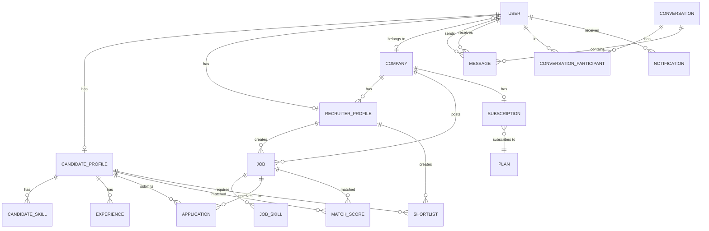
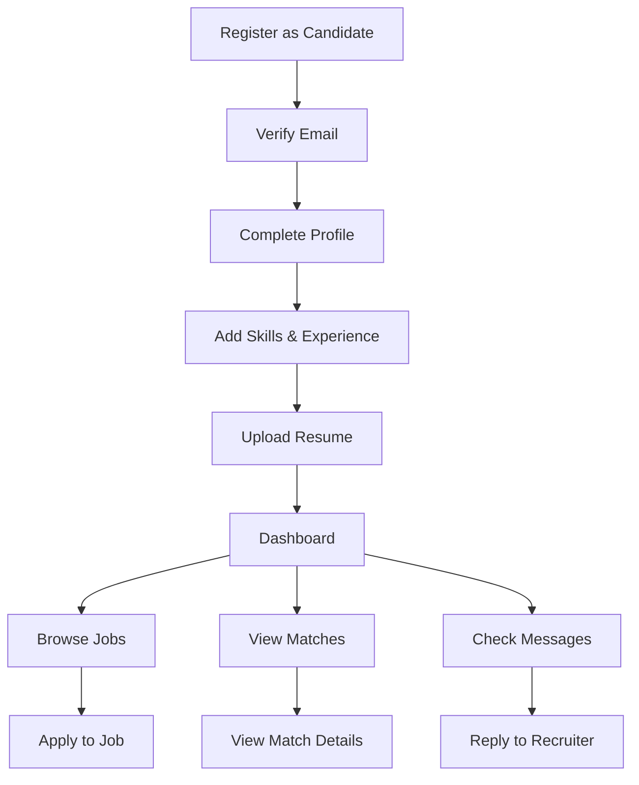
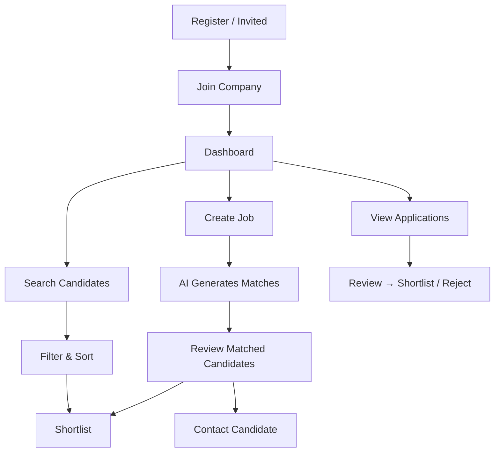
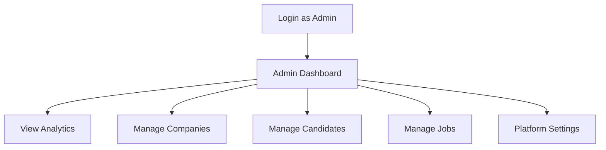

# TalentTap AI — Development Plan

> AI-powered talent marketplace. Candidates create profiles once. Companies find the best matches automatically.

---

## Table of Contents

1. [Project Structure](#1-project-structure)
2. [Database Schema & ERD](#2-database-schema--erd)
3. [User Flows](#3-user-flows)
4. [API Design](#4-api-design)
5. [Frontend Architecture](#5-frontend-architecture)
6. [AI Matching Engine](#6-ai-matching-engine)
7. [Execution Phases](#7-execution-phases)
8. [Deployment](#8-deployment)
9. [Open Questions](#9-open-questions)

---

## 1. Project Structure

```
FYP(SaaS)/
├── backend/                        # Django project
│   ├── manage.py
│   ├── requirements.txt
│   ├── .env.example
│   ├── core/                       # Project config
│   │   ├── settings/
│   │   │   ├── base.py
│   │   │   ├── dev.py
│   │   │   └── prod.py
│   │   ├── urls.py
│   │   ├── wsgi.py
│   │   └── asgi.py
│   └── apps/
│       ├── accounts/               # Auth, Users, Roles
│       │   ├── models.py
│       │   ├── serializers.py
│       │   ├── views.py
│       │   ├── urls.py
│       │   ├── permissions.py
│       │   ├── managers.py
│       │   └── services.py
│       ├── companies/              # Company profiles, Recruiters
│       │   ├── models.py
│       │   ├── serializers.py
│       │   ├── views.py
│       │   ├── urls.py
│       │   └── services.py
│       ├── candidates/             # Candidate profiles
│       │   ├── models.py
│       │   ├── serializers.py
│       │   ├── views.py
│       │   ├── urls.py
│       │   └── services.py
│       ├── jobs/                   # Job postings
│       │   ├── models.py
│       │   ├── serializers.py
│       │   ├── views.py
│       │   ├── urls.py
│       │   └── services.py
│       ├── matching/               # AI Matching Engine
│       │   ├── models.py
│       │   ├── engine.py           # Scoring logic
│       │   ├── serializers.py
│       │   ├── views.py
│       │   ├── urls.py
│       │   └── services.py
│       ├── applications/           # Job applications
│       │   ├── models.py
│       │   ├── serializers.py
│       │   ├── views.py
│       │   ├── urls.py
│       │   └── services.py
│       ├── messaging/              # Internal messaging
│       │   ├── models.py
│       │   ├── serializers.py
│       │   ├── views.py
│       │   ├── urls.py
│       │   └── services.py
│       ├── notifications/          # In-app notifications
│       │   ├── models.py
│       │   ├── serializers.py
│       │   ├── views.py
│       │   ├── urls.py
│       │   └── services.py
│       └── analytics/              # Admin dashboard data
│           ├── views.py
│           ├── urls.py
│           └── services.py
│
├── frontend/                       # React + Vite
│   ├── index.html
│   ├── vite.config.js
│   ├── jsconfig.json
│   ├── components.json
│   ├── package.json
│   └── src/
│       ├── main.jsx
│       ├── App.jsx
│       ├── index.css
│       ├── api/                    # Axios instance & API modules
│       │   ├── client.js           # Axios config, interceptors
│       │   ├── auth.js
│       │   ├── candidates.js
│       │   ├── companies.js
│       │   ├── jobs.js
│       │   ├── matching.js
│       │   ├── applications.js
│       │   ├── messaging.js
│       │   └── notifications.js
│       ├── contexts/               # React Context providers
│       │   ├── AuthContext.jsx
│       │   ├── NotificationContext.jsx
│       │   └── ThemeContext.jsx
│       ├── hooks/                  # Custom hooks
│       │   ├── useAuth.js
│       │   ├── useFetch.js
│       │   ├── useDebounce.js
│       │   └── usePagination.js
│       ├── components/             # Shared / reusable
│       │   ├── ui/                 # Shadcn components
│       │   ├── layout/
│       │   │   ├── AppShell.jsx
│       │   │   ├── Sidebar.jsx
│       │   │   ├── Topbar.jsx
│       │   │   └── MobileNav.jsx
│       │   ├── common/
│       │   │   ├── Logo.jsx
│       │   │   ├── EmptyState.jsx
│       │   │   ├── SkeletonCard.jsx
│       │   │   ├── ConfirmDialog.jsx
│       │   │   ├── FileUpload.jsx
│       │   │   ├── MatchScoreBadge.jsx
│       │   │   └── ProfileAvatar.jsx
│       │   └── forms/
│       │       ├── FormField.jsx
│       │       ├── SearchInput.jsx
│       │       └── FilterPanel.jsx
│       ├── pages/
│       │   ├── auth/
│       │   │   ├── LoginPage.jsx
│       │   │   ├── RegisterPage.jsx
│       │   │   ├── ForgotPasswordPage.jsx
│       │   │   └── ResetPasswordPage.jsx
│       │   ├── landing/
│       │   │   └── LandingPage.jsx
│       │   ├── candidate/
│       │   │   ├── DashboardPage.jsx
│       │   │   ├── ProfilePage.jsx
│       │   │   ├── JobsPage.jsx
│       │   │   ├── ApplicationsPage.jsx
│       │   │   ├── MatchesPage.jsx
│       │   │   └── MessagesPage.jsx
│       │   ├── recruiter/
│       │   │   ├── DashboardPage.jsx
│       │   │   ├── JobsPage.jsx
│       │   │   ├── JobDetailPage.jsx
│       │   │   ├── CreateJobPage.jsx
│       │   │   ├── CandidateSearchPage.jsx
│       │   │   ├── CandidateProfilePage.jsx
│       │   │   ├── ShortlistPage.jsx
│       │   │   ├── ApplicantsPage.jsx
│       │   │   └── MessagesPage.jsx
│       │   ├── company/
│       │   │   ├── ProfilePage.jsx
│       │   │   ├── TeamPage.jsx
│       │   │   └── SettingsPage.jsx
│       │   └── admin/
│       │       ├── DashboardPage.jsx
│       │       ├── CompaniesPage.jsx
│       │       ├── CandidatesPage.jsx
│       │       ├── JobsPage.jsx
│       │       └── SettingsPage.jsx
│       ├── routes/
│       │   ├── index.jsx           # Route definitions
│       │   ├── ProtectedRoute.jsx
│       │   └── RoleRoute.jsx
│       └── lib/
│           ├── utils.js            # Shadcn cn() utility
│           └── constants.js
│
├── docker-compose.yml
├── Dockerfile.backend
├── Dockerfile.frontend
├── nginx.conf
└── README.md
```

---

## 2. Database Schema & ERD

### 2.1 Entity Relationship Diagram



### 2.2 Model Definitions

#### `accounts.User` — Custom User Model

| Field | Type | Notes |
|-------|------|-------|
| `id` | UUID | PK |
| `email` | EmailField | unique, login identifier |
| `password` | CharField | hashed |
| `first_name` | CharField | |
| `last_name` | CharField | |
| `role` | CharField | choices: `admin`, `company_admin`, `recruiter`, `candidate` |
| `is_active` | BooleanField | |
| `is_email_verified` | BooleanField | |
| `avatar` | ImageField | nullable |
| `created_at` | DateTimeField | auto |
| `updated_at` | DateTimeField | auto |

#### `companies.Company`

| Field | Type | Notes |
|-------|------|-------|
| `id` | UUID | PK |
| `name` | CharField | |
| `slug` | SlugField | unique, URL-friendly |
| `logo` | ImageField | nullable |
| `description` | TextField | |
| `industry` | CharField | |
| `company_size` | CharField | choices: `1-10`, `11-50`, `51-200`, `201-500`, `501-1000`, `1000+` |
| `website` | URLField | nullable |
| `linkedin_url` | URLField | nullable |
| `location` | CharField | |
| `country` | CharField | |
| `city` | CharField | |
| `is_verified` | BooleanField | admin verifies |
| `created_by` | FK → User | company_admin who created it |
| `created_at` | DateTimeField | auto |
| `updated_at` | DateTimeField | auto |

#### `companies.RecruiterProfile`

| Field | Type | Notes |
|-------|------|-------|
| `id` | UUID | PK |
| `user` | OneToOne → User | |
| `company` | FK → Company | |
| `title` | CharField | e.g. "Senior Recruiter" |
| `department` | CharField | nullable |
| `is_active` | BooleanField | |
| `created_at` | DateTimeField | auto |

#### `candidates.CandidateProfile`

| Field | Type | Notes |
|-------|------|-------|
| `id` | UUID | PK |
| `user` | OneToOne → User | |
| `headline` | CharField | e.g. "Full-Stack Developer" |
| `about` | TextField | |
| `country` | CharField | |
| `city` | CharField | |
| `phone` | CharField | nullable |
| `years_of_experience` | IntegerField | |
| `employment_status` | CharField | choices: `employed`, `unemployed`, `freelancing`, `student` |
| `availability` | CharField | choices: `immediate`, `2_weeks`, `1_month`, `3_months`, `not_available` |
| `employment_type_preferred` | CharField | choices: `full_time`, `part_time`, `contract`, `freelance`, `internship` |
| `salary_min` | DecimalField | nullable |
| `salary_max` | DecimalField | nullable |
| `salary_currency` | CharField | default `USD` |
| `linkedin_url` | URLField | nullable |
| `github_url` | URLField | nullable |
| `portfolio_url` | URLField | nullable |
| `resume` | FileField | nullable, PDF only |
| `is_open_to_work` | BooleanField | |
| `profile_completion` | IntegerField | 0–100, computed |
| `created_at` | DateTimeField | auto |
| `updated_at` | DateTimeField | auto |

#### `candidates.CandidateSkill`

| Field | Type | Notes |
|-------|------|-------|
| `id` | UUID | PK |
| `candidate` | FK → CandidateProfile | |
| `name` | CharField | indexed |
| `proficiency` | CharField | choices: `beginner`, `intermediate`, `advanced`, `expert` |

#### `candidates.Experience`

| Field | Type | Notes |
|-------|------|-------|
| `id` | UUID | PK |
| `candidate` | FK → CandidateProfile | |
| `company_name` | CharField | |
| `title` | CharField | |
| `start_date` | DateField | |
| `end_date` | DateField | nullable (current role) |
| `is_current` | BooleanField | |
| `description` | TextField | |

#### `jobs.Job`

| Field | Type | Notes |
|-------|------|-------|
| `id` | UUID | PK |
| `company` | FK → Company | |
| `recruiter` | FK → RecruiterProfile | who created it |
| `title` | CharField | |
| `slug` | SlugField | unique |
| `description` | TextField | |
| `experience_min` | IntegerField | years |
| `experience_max` | IntegerField | years |
| `employment_type` | CharField | choices: `full_time`, `part_time`, `contract`, `freelance`, `internship` |
| `location` | CharField | |
| `country` | CharField | |
| `city` | CharField | |
| `is_remote` | CharField | choices: `remote`, `onsite`, `hybrid` |
| `salary_min` | DecimalField | nullable |
| `salary_max` | DecimalField | nullable |
| `salary_currency` | CharField | |
| `status` | CharField | choices: `draft`, `active`, `paused`, `closed`, `archived` |
| `application_deadline` | DateField | nullable |
| `is_featured` | BooleanField | for future monetization |
| `created_at` | DateTimeField | auto |
| `updated_at` | DateTimeField | auto |

#### `jobs.JobSkill`

| Field | Type | Notes |
|-------|------|-------|
| `id` | UUID | PK |
| `job` | FK → Job | |
| `name` | CharField | indexed |
| `is_required` | BooleanField | required vs nice-to-have |

#### `matching.MatchScore`

| Field | Type | Notes |
|-------|------|-------|
| `id` | UUID | PK |
| `job` | FK → Job | |
| `candidate` | FK → CandidateProfile | |
| `overall_score` | DecimalField | 0–100 |
| `skills_score` | DecimalField | 0–100 |
| `experience_score` | DecimalField | 0–100 |
| `location_score` | DecimalField | 0–100 |
| `availability_score` | DecimalField | 0–100 |
| `employment_type_score` | DecimalField | 0–100 |
| `breakdown` | JSONField | full explanation |
| `created_at` | DateTimeField | auto |
| `updated_at` | DateTimeField | auto |

> **unique_together**: `(job, candidate)` — one score per job-candidate pair.

#### `applications.Application`

| Field | Type | Notes |
|-------|------|-------|
| `id` | UUID | PK |
| `job` | FK → Job | |
| `candidate` | FK → CandidateProfile | |
| `status` | CharField | choices: `applied`, `reviewing`, `shortlisted`, `interview`, `offered`, `rejected`, `withdrawn` |
| `cover_letter` | TextField | nullable |
| `created_at` | DateTimeField | auto |
| `updated_at` | DateTimeField | auto |

> **unique_together**: `(job, candidate)`

#### `applications.Shortlist`

| Field | Type | Notes |
|-------|------|-------|
| `id` | UUID | PK |
| `recruiter` | FK → RecruiterProfile | |
| `candidate` | FK → CandidateProfile | |
| `job` | FK → Job | nullable (general shortlist) |
| `notes` | TextField | nullable |
| `created_at` | DateTimeField | auto |

#### `messaging.Conversation`

| Field | Type | Notes |
|-------|------|-------|
| `id` | UUID | PK |
| `created_at` | DateTimeField | auto |
| `updated_at` | DateTimeField | auto (last message time) |

#### `messaging.ConversationParticipant`

| Field | Type | Notes |
|-------|------|-------|
| `id` | UUID | PK |
| `conversation` | FK → Conversation | |
| `user` | FK → User | |
| `last_read_at` | DateTimeField | nullable |

#### `messaging.Message`

| Field | Type | Notes |
|-------|------|-------|
| `id` | UUID | PK |
| `conversation` | FK → Conversation | |
| `sender` | FK → User | |
| `content` | TextField | |
| `created_at` | DateTimeField | auto |

#### `notifications.Notification`

| Field | Type | Notes |
|-------|------|-------|
| `id` | UUID | PK |
| `user` | FK → User | |
| `type` | CharField | choices: `match`, `application`, `message`, `job_status`, `system` |
| `title` | CharField | |
| `message` | TextField | |
| `is_read` | BooleanField | default False |
| `action_url` | CharField | nullable, frontend route to navigate |
| `created_at` | DateTimeField | auto |

#### `companies.Subscription` (future-ready)

| Field | Type | Notes |
|-------|------|-------|
| `id` | UUID | PK |
| `company` | OneToOne → Company | |
| `plan` | FK → Plan | |
| `status` | CharField | choices: `active`, `cancelled`, `expired`, `trial` |
| `starts_at` | DateTimeField | |
| `expires_at` | DateTimeField | |
| `created_at` | DateTimeField | auto |

#### `companies.Plan` (future-ready)

| Field | Type | Notes |
|-------|------|-------|
| `id` | UUID | PK |
| `name` | CharField | e.g. "Starter", "Pro", "Enterprise" |
| `price` | DecimalField | |
| `billing_cycle` | CharField | `monthly`, `yearly` |
| `max_jobs` | IntegerField | |
| `max_candidates_per_search` | IntegerField | |
| `features` | JSONField | |
| `is_active` | BooleanField | |

### 2.3 Indexes

| Table | Index | Purpose |
|-------|-------|---------|
| `CandidateSkill` | `name` | Fast skill search |
| `JobSkill` | `name` | Fast skill matching |
| `CandidateProfile` | `country`, `city` | Location filtering |
| `CandidateProfile` | `employment_status`, `availability` | Status filtering |
| `CandidateProfile` | `is_open_to_work` | Active candidate search |
| `Job` | `status`, `country`, `city` | Job search |
| `MatchScore` | `overall_score` | Ranked results |
| `Application` | `status` | Pipeline filtering |
| `Notification` | `user`, `is_read` | Unread count |

---

## 3. User Flows

### 3.1 Candidate Flow



### 3.2 Recruiter Flow



### 3.3 Admin Flow



---

## 4. API Design

Base: `/api/v1/`

### 4.1 Authentication

| Method | Endpoint | Description |
|--------|----------|-------------|
| POST | `/auth/register/` | Register new user |
| POST | `/auth/login/` | Obtain JWT tokens |
| POST | `/auth/token/refresh/` | Refresh access token |
| POST | `/auth/forgot-password/` | Request password reset |
| POST | `/auth/reset-password/` | Reset password with token |
| GET | `/auth/me/` | Get current user |
| PATCH | `/auth/me/` | Update current user |

### 4.2 Candidates

| Method | Endpoint | Description |
|--------|----------|-------------|
| GET | `/candidates/profile/` | Get own profile |
| PUT | `/candidates/profile/` | Update profile |
| GET | `/candidates/skills/` | List own skills |
| POST | `/candidates/skills/` | Add skill |
| DELETE | `/candidates/skills/{id}/` | Remove skill |
| GET | `/candidates/experience/` | List experience |
| POST | `/candidates/experience/` | Add experience |
| PUT | `/candidates/experience/{id}/` | Update experience |
| DELETE | `/candidates/experience/{id}/` | Delete experience |
| POST | `/candidates/resume/` | Upload resume |
| GET | `/candidates/search/` | Search candidates (recruiter) |
| GET | `/candidates/{id}/` | View candidate profile (recruiter) |

### 4.3 Companies

| Method | Endpoint | Description |
|--------|----------|-------------|
| GET | `/companies/profile/` | Get own company |
| PUT | `/companies/profile/` | Update company |
| GET | `/companies/recruiters/` | List recruiters |
| POST | `/companies/recruiters/invite/` | Invite recruiter |
| DELETE | `/companies/recruiters/{id}/` | Remove recruiter |

### 4.4 Jobs

| Method | Endpoint | Description |
|--------|----------|-------------|
| GET | `/jobs/` | List jobs (filtered by role) |
| POST | `/jobs/` | Create job (recruiter) |
| GET | `/jobs/{id}/` | Job detail |
| PUT | `/jobs/{id}/` | Update job |
| PATCH | `/jobs/{id}/status/` | Change job status |
| GET | `/jobs/{id}/matches/` | Get matched candidates |
| GET | `/jobs/{id}/applicants/` | Get applicants |

### 4.5 Applications

| Method | Endpoint | Description |
|--------|----------|-------------|
| POST | `/applications/` | Apply to job |
| GET | `/applications/` | List own applications |
| PATCH | `/applications/{id}/status/` | Update status (recruiter) |

### 4.6 Shortlists

| Method | Endpoint | Description |
|--------|----------|-------------|
| GET | `/shortlists/` | List shortlisted candidates |
| POST | `/shortlists/` | Add to shortlist |
| DELETE | `/shortlists/{id}/` | Remove from shortlist |

### 4.7 Matching

| Method | Endpoint | Description |
|--------|----------|-------------|
| POST | `/matching/jobs/{id}/run/` | Run matching for a job |
| GET | `/matching/jobs/{id}/results/` | Get match results |
| GET | `/matching/candidates/me/` | Candidate's job matches |

### 4.8 Messaging

| Method | Endpoint | Description |
|--------|----------|-------------|
| GET | `/messages/conversations/` | List conversations |
| POST | `/messages/conversations/` | Start conversation |
| GET | `/messages/conversations/{id}/` | Get messages |
| POST | `/messages/conversations/{id}/` | Send message |
| POST | `/messages/conversations/{id}/read/` | Mark as read |

### 4.9 Notifications

| Method | Endpoint | Description |
|--------|----------|-------------|
| GET | `/notifications/` | List notifications |
| GET | `/notifications/unread-count/` | Unread count |
| POST | `/notifications/{id}/read/` | Mark as read |
| POST | `/notifications/read-all/` | Mark all as read |

### 4.10 Admin / Analytics

| Method | Endpoint | Description |
|--------|----------|-------------|
| GET | `/admin/analytics/overview/` | Dashboard stats |
| GET | `/admin/companies/` | List all companies |
| GET | `/admin/candidates/` | List all candidates |
| GET | `/admin/jobs/` | List all jobs |

---

## 5. Frontend Architecture

### 5.1 Tech Stack

| Concern | Choice |
|---------|--------|
| Build | Vite |
| UI Library | React (JS, no TS) |
| Component System | Shadcn UI |
| CSS | Tailwind CSS v4 |
| Routing | React Router v7 |
| State | Context API |
| HTTP | Axios |
| Forms | React Hook Form + Zod (via Shadcn) |
| Icons | Lucide React |
| Charts | Recharts |

### 5.2 Design System

- **Color Palette**: Deep indigo primary (`#4F46E5`), warm slate neutrals, emerald accent for success states
- **Typography**: Inter (Google Fonts) — clean, modern SaaS look
- **Border Radius**: Rounded-lg default for cards, rounded-md for inputs
- **Shadows**: Subtle layered shadows for depth
- **Dark Mode**: Ready via CSS variables (implement in Phase 5)

### 5.3 Key UI Components

| Component | Description |
|-----------|-------------|
| `AppShell` | Sidebar + topbar layout with collapsible nav |
| `EmptyState` | Illustrated empty states for all lists |
| `SkeletonCard` | Loading skeletons for cards, tables, profiles |
| `MatchScoreBadge` | Circular progress showing match % with color coding |
| `ProfileAvatar` | User avatar with fallback initials |
| `FileUpload` | Drag-and-drop file upload with preview |
| `FilterPanel` | Reusable filter sidebar for search pages |
| `StatCard` | Dashboard metric card with icon, value, trend |
| `DataTable` | Sortable, paginated table with actions |
| `ConfirmDialog` | Reusable confirmation modal |

### 5.4 Routing Structure

```
/                       → Landing page
/login                  → Login
/register               → Register (role selection)
/forgot-password        → Forgot password
/reset-password/:token  → Reset password

/candidate/dashboard    → Candidate dashboard
/candidate/profile      → Edit profile
/candidate/jobs         → Browse & search jobs
/candidate/applications → My applications
/candidate/matches      → My matches
/candidate/messages     → Messages

/recruiter/dashboard    → Recruiter dashboard
/recruiter/jobs         → Manage jobs
/recruiter/jobs/new     → Create job
/recruiter/jobs/:id     → Job detail + matches + applicants
/recruiter/candidates   → Search candidates
/recruiter/candidates/:id → View candidate profile
/recruiter/shortlists   → Shortlisted candidates
/recruiter/messages     → Messages

/company/profile        → Company profile
/company/team           → Manage recruiters
/company/settings       → Company settings

/admin/dashboard        → Admin dashboard
/admin/companies        → Manage companies
/admin/candidates       → Manage candidates
/admin/jobs             → Manage jobs
/admin/settings         → Platform settings
```

---

## 6. AI Matching Engine

### 6.1 Scoring Algorithm

The matching engine computes a weighted score across 5 dimensions:

```python
WEIGHTS = {
    'skills':          0.40,   # Most important
    'experience':      0.25,
    'location':        0.15,
    'availability':    0.10,
    'employment_type': 0.10,
}
```

#### Skills Score (0–100)
```
matched_skills = intersection(candidate_skills, job_skills)
required_job_skills = job_skills where is_required=True
score = (len(matched_required) / len(required_job_skills)) * 80
     + (len(matched_nice_to_have) / len(nice_to_have_skills)) * 20
```
Case-insensitive matching. Proficiency level adds a bonus multiplier.

#### Experience Score (0–100)
```
candidate_years = candidate.years_of_experience
if candidate_years >= job.experience_min and candidate_years <= job.experience_max:
    score = 100
elif candidate_years >= job.experience_min:
    score = max(70, 100 - (candidate_years - job.experience_max) * 5)
else:
    score = max(0, (candidate_years / job.experience_min) * 80)
```

#### Location Score (0–100)
```
if job.is_remote == 'remote':
    score = 100
elif candidate.country == job.country and candidate.city == job.city:
    score = 100
elif candidate.country == job.country:
    score = 70
else:
    score = 30
```

#### Availability Score (0–100)
```
AVAILABILITY_SCORES = {
    'immediate': 100,
    '2_weeks': 90,
    '1_month': 70,
    '3_months': 40,
    'not_available': 0,
}
```

#### Employment Type Score (0–100)
```
if candidate.employment_type_preferred == job.employment_type:
    score = 100
else:
    score = 40  # willing but not preferred
```

#### Overall Score
```
overall = sum(score * weight for score, weight in zip(scores, weights))
```

### 6.2 Stored Breakdown Example

```json
{
  "overall_score": 89,
  "breakdown": {
    "skills": {"score": 95, "weight": 0.40, "matched": ["Python", "Django", "React"], "missing": ["GraphQL"]},
    "experience": {"score": 85, "weight": 0.25, "candidate_years": 4, "required": "3-5"},
    "location": {"score": 100, "weight": 0.15, "reason": "Remote position"},
    "availability": {"score": 90, "weight": 0.10, "candidate": "2 weeks"},
    "employment_type": {"score": 100, "weight": 0.10, "match": "full_time"}
  }
}
```

### 6.3 Future Extensibility

The engine is isolated in `apps/matching/engine.py`. To upgrade:
1. Replace `engine.py` with an embeddings-based scorer
2. The `MatchScore` model stays the same
3. Add a strategy pattern: `ScoringStrategy` base class → `RuleBasedStrategy`, `EmbeddingStrategy`

---

## 7. Execution Phases

### Phase 1 — Architecture & Design ✅ (this document)

### Phase 2 — Backend Implementation

1. Django project setup (`core/settings/`)
2. Custom User model + JWT auth
3. Company & Recruiter models + APIs
4. Candidate profile models + APIs
5. Job models + APIs
6. Application & Shortlist models + APIs
7. Matching engine + APIs
8. Messaging models + APIs
9. Notification models + APIs
10. Admin analytics APIs

**Estimated files**: ~45 files
**Estimated effort**: Largest phase

### Phase 3 — Frontend Implementation

1. Vite + React + Shadcn setup
2. Auth context + API client + routing
3. Landing page
4. Auth pages (login, register, forgot/reset password)
5. Candidate pages (dashboard, profile, jobs, applications, matches, messages)
6. Recruiter pages (dashboard, jobs, candidates, shortlists, messages)
7. Company pages (profile, team, settings)
8. Admin pages (dashboard, companies, candidates, jobs)

**Estimated files**: ~60 files

### Phase 4 — AI Matching Engine Integration

1. Implement scoring algorithm in `engine.py`
2. Connect to job creation flow (auto-match on publish)
3. Build match results UI with score breakdown
4. Add "Run Matching" action for recruiters

### Phase 5 — Polish & Optimization

1. Empty states for all list views
2. Skeleton loaders on data fetches
3. Form validation UX
4. Error handling & toast notifications
5. Responsive testing
6. Performance optimization

---

## 8. Deployment

### Backend (Docker + Gunicorn)

```dockerfile
# Dockerfile.backend
FROM python:3.12-slim
WORKDIR /app
COPY requirements.txt .
RUN pip install -r requirements.txt
COPY backend/ .
CMD ["gunicorn", "core.wsgi:application", "--bind", "0.0.0.0:8000", "--workers", "3"]
```

### Frontend (Vercel / Nginx)

```
# Build command
npm run build

# Output: dist/
```

### docker-compose.yml

Services:
- `db` — PostgreSQL 16
- `backend` — Django + Gunicorn
- `frontend` — Nginx serving built React app
- `redis` — Redis (ready for Celery)

